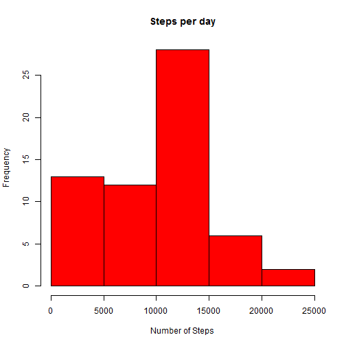
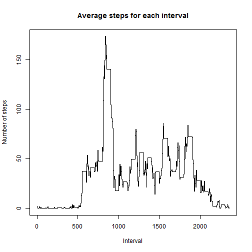
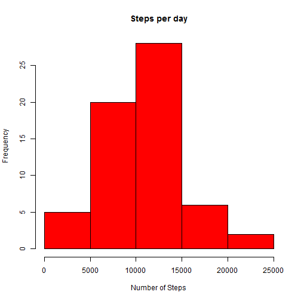

Read in the data and format it:


```r
activity_data <- read.csv("activity.csv", colClasses = c("numeric", "character", "numeric")) 
```

Process the data to get the steps per day, create the histogram, and calculate the mean and median: 

```r
days <- unique(activity_data$date)
day_steps <- matrix(nrow = length(days), ncol = 2)
colnames(day_steps) <- c("Day", "Number of Steps")
day_steps[,1] <- 1:length(days)
for(i in 1:length(days)){
  temp <- subset(activity_data,date == days[i])
  day_steps[i,2] = sum(temp[,1], na.rm = TRUE)
}
mean_steps_per_day <- mean(day_steps[,2])
median_steps_per_day <- round(median(day_steps[,2]))
hist(day_steps[,2], main = "Steps per day", col = "red", breaks = 7, xlab = "Number of Steps")
```

 
  
The mean steps per day is 9354.2295082.  
The median steps per day is 1.0395 &times; 10<sup>4</sup>
(should say 10395, but it's not formatting properly).  


```r
intervals <- unique(activity_data$interval)
interval_steps <- matrix(nrow = length(intervals), ncol = 2)
colnames(interval_steps) <- c("Interval", "Num_Steps")
interval_steps[,1] = activity_data[1:length(intervals),3]
for(i in 1:length(intervals)){
  temp <- subset(activity_data,interval == intervals[i])
  interval_steps[i,2] = sum(temp[,1], na.rm = TRUE)
}

maxinterval = interval_steps[interval_steps[,"Num_Steps"]==max(interval_steps[,2]),1]

interval_average <- cbind(interval_steps[,1],interval_steps[,2]/63)
plot(interval_average[,1], type = "s", y = interval_average[,2], xlab = "Interval", ylab = "Number of steps", main = "Average steps for each interval")  
```

 
    
The interval with the highest number of steps is 835.  


```r
NA_removed_data <- activity_data
for(i in 1:length(activity_data$steps))
  if(is.na(activity_data[i,1])){
    NA_removed_data[i,1] <- interval_average[interval_average[,1]==activity_data[i,3],2]
  }
NA_count <- sum(is.na(activity_data[,1]))
```
There are 2304 NAs in the data. I chose to replace each NA with the mean of the interval containing the NA.   

```r
NArem_day_steps <- matrix(nrow = length(days), ncol = 2)
colnames(NArem_day_steps) <- c("Day", "Number of Steps")
NArem_day_steps[,1] <- 1:length(days)
for(i in 1:length(days)){
  temp <- subset(NA_removed_data,date == days[i])
  NArem_day_steps[i,2] <- sum(temp[,1])
}
NArem_mean_steps<- mean(NArem_day_steps[,2])
NArem_median_steps <- round(median(NArem_day_steps[,2]))
hist(NArem_day_steps[,2], main = "Steps per day", col = "red", breaks = 7, xlab = "Number of Steps")
```

 
With the NAs removed, the mean steps per day is 1.0542068 &times; 10<sup>4</sup>(~10542.07) and the median is 1.0395 &times; 10<sup>4</sup> (10395). The data is more centered since the NAs had brought down the average for some days. However, the change in bottom of the distribution didn't affect the order by day of steps, and 10395 for day 20 stayed the median.  


